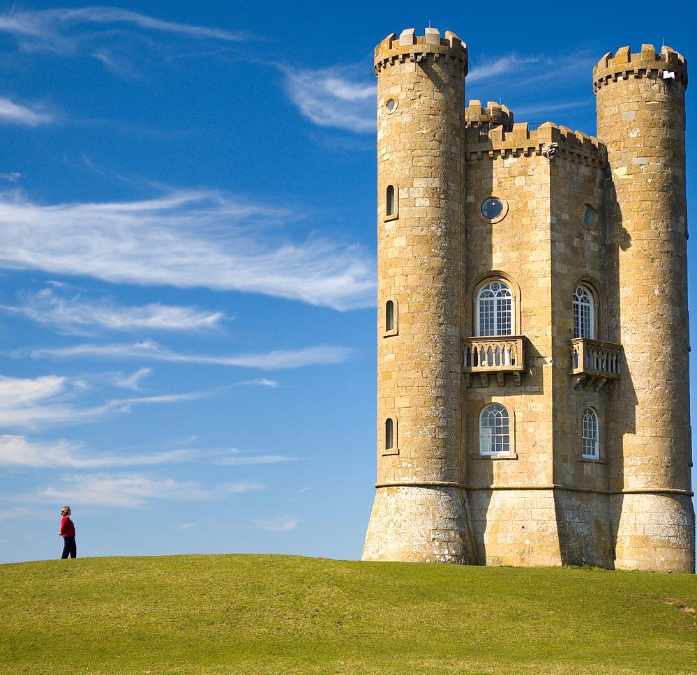
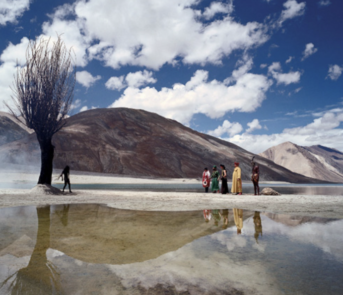

# Content-Aware Image Resizing (Seam Carving)

This project implements **content-aware image resizing** using the **Seam Carving** technique. Seam carving resizes images by intelligently removing or inserting seams—paths of least importance—preserving key visual content instead of uniformly scaling or cropping.

## Features

Three different algorithms were implemented to perform seam carving:

### 1. Brute Force (BF)
- **Description**: Tries all possible vertical seams to find the lowest energy path.
- **Use case**: Only works efficiently for *very small images* (e.g., 10x10 or 20x20).
- **Limitation**: Extremely slow and memory-intensive for larger images.

### 2. Greedy Approach
- **Description**: Selects the least energy pixel from the three possible options at each row (up-left, up, up-right).
- **Performance**: Very fast, but not guaranteed to find the optimal seam.
- **Use case**: Useful when speed is prioritized over quality.

### 3. Dynamic Programming (DP)
- **Description**: Computes the optimal vertical seam using a DP table to accumulate energy values.
- **Performance**: Fast and guarantees the optimal solution.
- **Recommended**: This is the best method for real-world image resizing.

## 🖼️ Sample Result using Dynamic Programming

**Original:**  

**Resized using DP:**  

---

**Original:**  

**Resized using DP:**  

## 📄 Resources

- [📄 Analysis of Different Algorithmic Design Techniques (PDF)](Resources/Analysis_of_Different_Algorithmic_Design_Technique.pdf)

